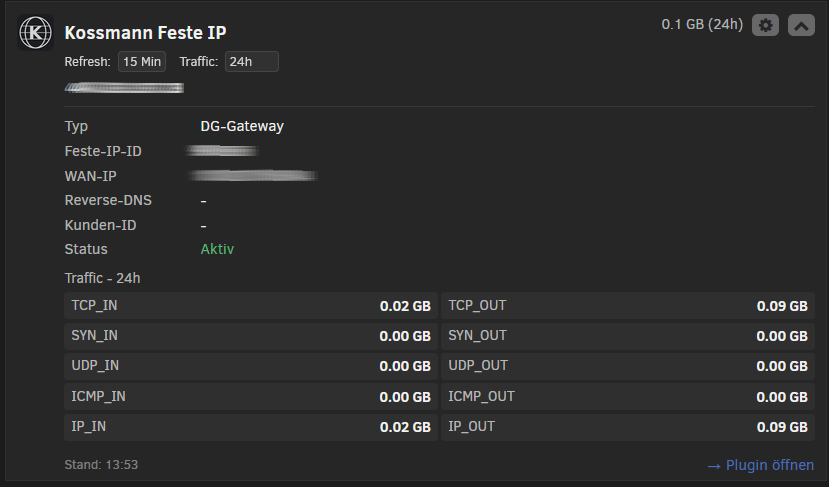
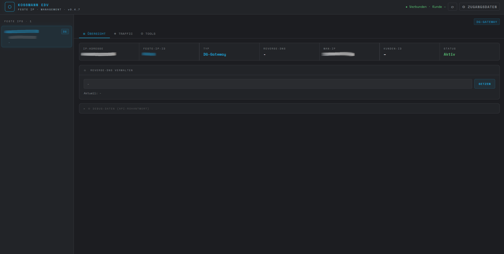
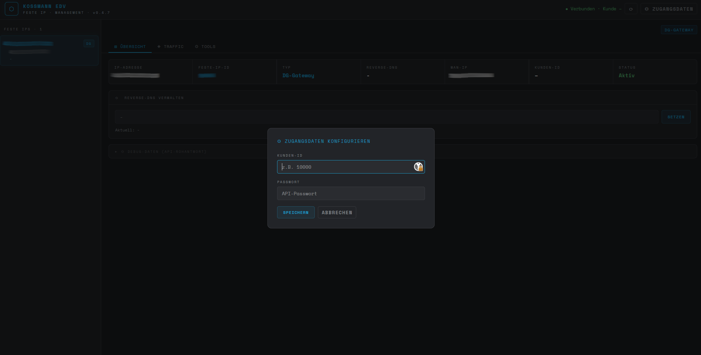
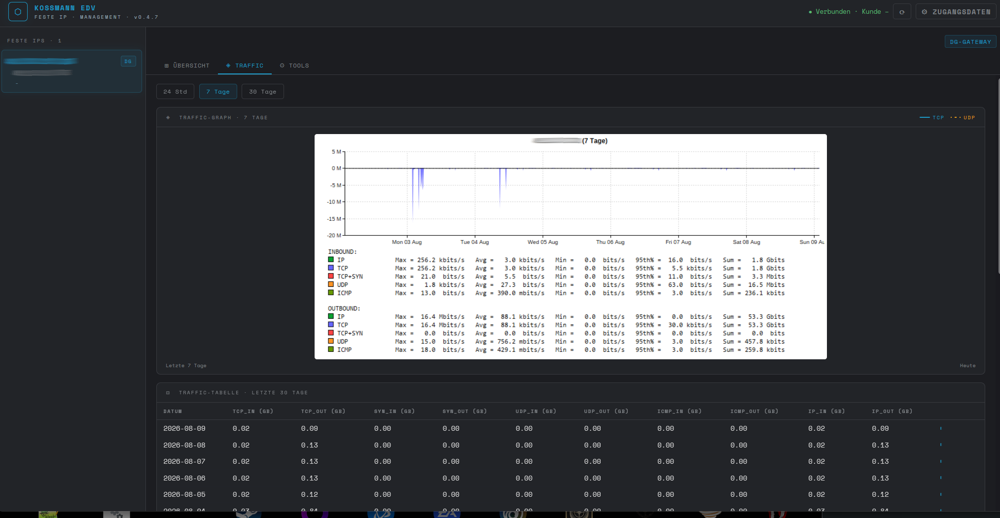
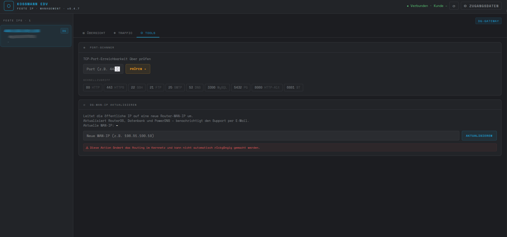

# Kossmann Feste IP Manager

Ein Unraid-Plugin zur Verwaltung öffentlicher IPv4-Adressen (Feste IP via DG-Gateway / OpenVPN) über die Kossmann-EDV-API — direkt aus der Unraid-Weboberfläche.

Verkehrsdaten abrufen, Reverse-DNS verwalten, Ports prüfen und die DG-WAN-IP aktualisieren, ohne das Kundenportal zu öffnen. Inklusive Dashboard-Kachel mit Live-Übersicht.

---

## Features

- **Feste IPs auflisten** — alle dem Kunden zugeordneten Einträge (DG-Gateway & OpenVPN)
- **Details** — IP, Feste-IP-ID, WAN-IP, Reverse-DNS, Kunden-ID, Status
- **Reverse-DNS verwalten** — RDNS setzen (aktualisiert DB, MyLOC-API und PowerDNS)
- **Traffic-Graph** — Base64-PNG-Diagramm für 24 Stunden, 7 oder 30 Tage
- **Traffic-Tabelle** — tagesweise Verkehrsstatistik der letzten 30 Tage nach Protokoll
- **Port-Scanner** — TCP-Port-Erreichbarkeit über die öffentliche IP prüfen
- **DG-WAN-IP aktualisieren** — Weiterleitung der öffentlichen IP auf eine neue Router-WAN-IP
- **Dashboard-Kachel** — eingeklappt (IP + Traffic), ausgeklappt (alle Details + Traffic), mit einstellbarem Refresh-Intervall und Zeitraum

Zugangsdaten werden ausschließlich serverseitig verwendet (PHP/cURL) und lokal unter `/boot/config/plugins/kossmann-festeip-manager/config.json` gespeichert — sie verlassen den Unraid-Server nie über den Browser.

---

## Installation

1. In der Unraid-Weboberfläche: **Plugins → Install Plugin**
2. Folgende URL einfügen und installieren:

```
https://raw.githubusercontent.com/ezek1el/kossmann-festeip-manager/refs/heads/main/kossmann-festeip-manager.plg
```

3. Nach der Installation erscheint der Menüpunkt unter **Settings → Utilities → Kossmann Feste IP**

### Erste Einrichtung

- ** Zugangsdaten** anklicken
- Kunden-ID und API-Passwort eingeben
- **Speichern** — die IP-Liste wird automatisch geladen

### Dashboard-Kachel aktivieren

- Zum **Dashboard** wechseln
- **Tile-Management** öffnen (Zahnrad-Symbol)
- **Kossmann Feste IP** anhaken → **Apply**

---

## Voraussetzungen

- Unraid 6.12 oder neuer
- Gültige Kossmann-EDV-Zugangsdaten (Kunden-ID + API-Passwort)

---

## Verwendete API-Endpunkte

Alle Aufrufe laufen serverseitig über einen PHP/cURL-Proxy (`?api=1&action=…`). Basis: `https://kossmann.center/api/?module=festeip`

| Aktion | Methode | Zweck |
|---|---|---|
| `list` | GET | Alle Feste IPs auflisten |
| `details` | GET | Details einer Festen IP (`id`) |
| `traffic_graph` | GET | Base64-PNG-Diagramm (`id`, `period`) |
| `traffic_table` | GET | Tagesweise Verkehrsstatistik 30 Tage (`id`) |
| `rdns_manage` | POST | Reverse-DNS setzen (`id`, `rdns`) |
| `portscan` | POST | TCP-Port prüfen (`id`, `port`) |
| `dgwan_manage` | POST | DG-WAN-IP aktualisieren (`id`, `dg_ipv4_neu`) |

---

## Aufbau

```
/usr/local/emhttp/plugins/kossmann-festeip-manager/
├── KossmannFesteIP.php            # API-Proxy + Haupt-Weboberfläche
├── KossmannFesteIP.page           # Menüeintrag (Settings → Utilities)
├── KossmannFesteIPDashboard.page  # Dashboard-Kachel
└── images/plugin-icon.png

/boot/config/plugins/kossmann-festeip-manager/
└── config.json                    # Zugangsdaten (Kunden-ID + Passwort)
```

Das `.plg` enthält alle Dateien eingebettet (Base64/INLINE) — es ist kein externer Download während der Installation nötig.

---

## Entwicklung

Die Quelldateien liegen unter `source/`. Änderungen am Plugin werden in die `.plg` eingebettet. Nach jeder Änderung wird die Version an drei Stellen synchron erhöht:

- `<!ENTITY version>` in `kossmann-festeip-manager.plg`
- `const KFIP_VER` in `source/KossmannFesteIP.php`
- der Dateiname-unabhängige Changelog-Eintrag

Versionsschema (Semver): Bugfixes → `0.4.x`, größere Änderungen → `0.x.0`.

---

## Screenshots

### Dashboard-Kachel

Kompakte Übersicht direkt im Unraid-Dashboard — eingeklappt nur IP und Traffic, ausgeklappt alle Details samt Verkehrsstatistik. Refresh-Intervall und Zeitraum sind über das Zahnrad einstellbar.



### Übersicht

Alle Feste IPs in der Seitenleiste, Details und Reverse-DNS-Verwaltung im Hauptbereich.



### Zugangsdaten

Beim ersten Start werden Kunden-ID und API-Passwort abgefragt. Sie werden ausschließlich lokal auf dem Unraid-Server gespeichert.



### Traffic

Verkehrsdiagramm für 24 Stunden, 7 oder 30 Tage sowie die tagesweise Statistik nach Protokoll.



### Tools

Port-Scanner mit Schnellzugriff auf gängige Ports und die DG-WAN-IP-Aktualisierung.



---

## Changelog

Siehe [CHANGELOG.md](CHANGELOG.md).

---

## Lizenz

MIT — siehe [LICENSE](LICENSE).

---

## Support

Fehler und Anfragen bitte über [GitHub Issues](https://github.com/ezek1el/kossmann-festeip-manager/issues).
